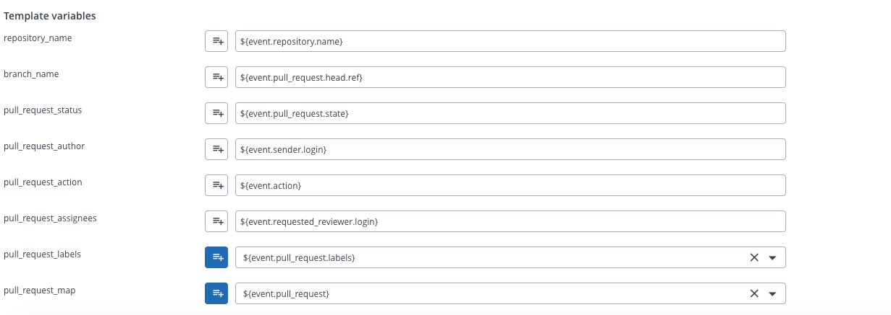

# Xlr-github-webhooks-samples
## Setting up an XLR webhook trigger (Github event type -> PUSH)
Once Add trigger is selected you should have a list of trigger types to choose from.  
Select *webhook event trigger* as trigger type and select the event source created on step 1.

Fill in other fields as needed.
### Features for trigger set ups
Select a filter rule from the drop down list in order to filter requests to this trigger.
Under visual design a rule set up would look something like: 
By creating this rule this trigger would only be triggered when the reference contains master and the repository is equals to xlr-webhooks-samples of the push event would be equal to the specified name passed.
e.g the json request would look something like
 ```
{
  "ref": "refs/heads/master",      <------ filter checks if master is in here
  "before": "958fb9525db170a4044f23429caea13603a4666a",
  "after": "48303e0898c591765c7b839d99f73f98f84eca80",
  "repository": {
     "id": 282020003,
     "name": "xlr-webhooks-samples" <------- filter checks for this name
  },
  "pusher": {"some data here"},
  "organization": {"some data here"},
  "sender": {"some data here"},
  "created": false,
  "deleted": false,
  "forced": false,
  "base_ref": null,
  "compare": "https://github.com/xebialabs-community/xlr-github-webhooks-samples/compare/958fb9525db1...48303e0898c5",
  "commits": [{"some data here"}],
  "head_commit": {
      "id": "73f61ed97706a0b1d11e79f6068aba1eb7d271f7",
      "tree_id": "25bfab4034050d22f92fcae87339b5dc5261b6ac",
      "distinct": true,
      "message": "Create update_read_me.json",
      "timestamp": "2020-07-23T14:02:10-04:00",
      "url": "https://github.com/xebialabs-community/xlr-github-webhooks-samples/commit/73f61ed97706a0b1d11e79f6068aba1eb7d271f7",
      "author": {
        "name": "Fellipe A",    
        "email": "*****@gmail.com",
        "username": "FellipeAvanci"
      },
      "committer": {
        "name": "GitHub",
        "email": "noreply@github.com",
        "username": "web-flow"
      },
      "added": [
        "update_read_me.json"
      ],
      "removed": [
  
      ],
      "modified": [
  
      ]
    }
}
``` 

### Use elements of json as values for XLR 
Elements of the json request can be used as values for xlr fields as for example: 


### Use Template variables 
Template variables can be filled based on trigger event data as for example:  


This is the template after execution (push trigger) variables and release title reflecting data from json push event.


## Setting up an XLR webhook trigger (Github event type -> PULL REQUEST)
### Features for trigger set ups
Trigger type with Pull request filter example: 
Pull request trigger will only be executed if action is 'open'.


### Use elements of json as values for XLR 
Release form with pull request example: 
Release title built with elements from json.


### Use Template variables 
Release variables with pull request example:


Template after pull request trigger execution
Title is formed correctly and variables populated for example: 
